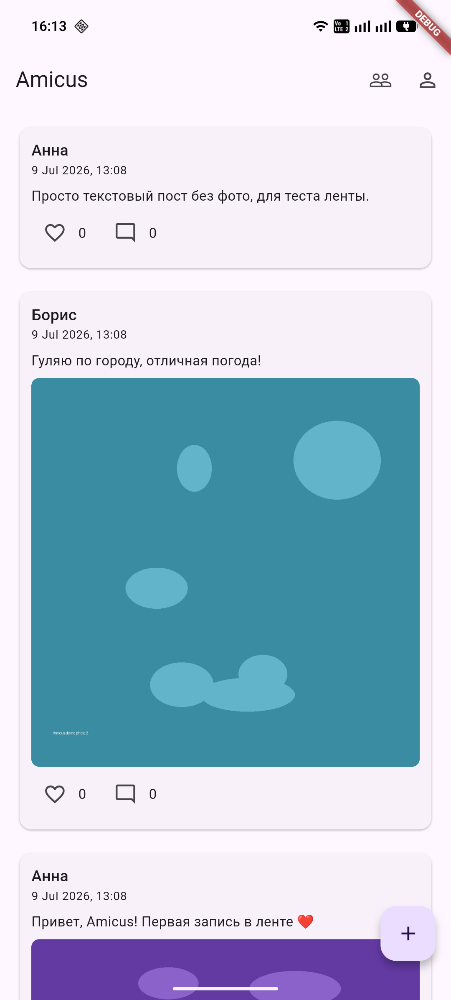
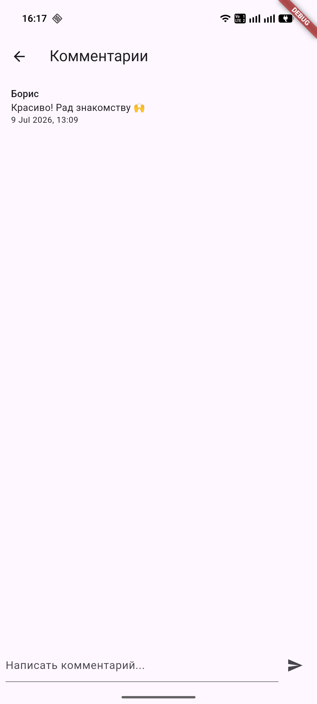
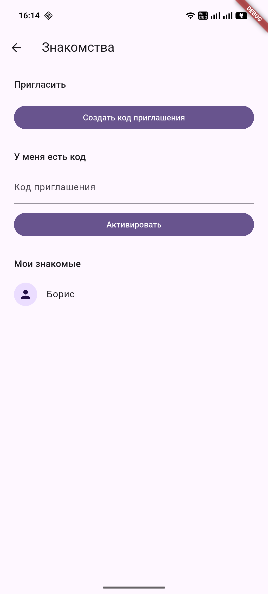
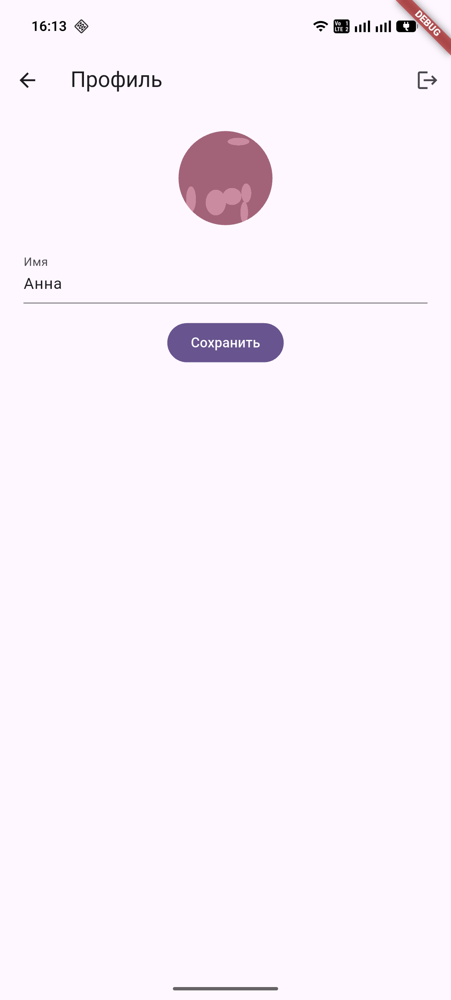

# Amicus

> Соцсеть-лента, где ты видишь посты только тех людей, с которыми познакомился по-настоящему — через личную встречу или приглашение от друга.

Идея приложения — это не только приватность, но и **цифровой детокс**: лента не бесконечна и не управляется алгоритмом. Ты видишь контент только своих связей (Connections), без случайных рекомендаций и давления бесконечного скроллинга. При этом ты не теряешь связь с друзьями — контент остаётся, просто в узком кругу своих знакомых.

Пилотный/портфолио-проект (изначально шёл под рабочим названием «Круг»). Исходная идея и механика — в [docs/project-brief.md](docs/project-brief.md); действующая схема данных — в [docs/data-model.md](docs/data-model.md) (в брифе лежит её первый черновик, а не то, что получилось).

## Статус

Задеплоено на Android (Google Play, Closed testing — трек `alpha`). Сейчас —
тестирование и донастройка фич на Android; следующая веха — релиз под iOS (см.
[docs/future-development.md](docs/future-development.md)).

## Что умеет

- Вход/регистрация, профиль с галереей фото (до 80) и собственной стеной постов
- Знакомства по invite-ссылке — с просмотром профиля и постов знакомого
- Лента: текст и до 20 фото/видео на пост, реакции, комментарии с ответами (один уровень вложенности)
- Комнаты: отдельная лента и чат для тех, кого позвали — пост адресуется в общую ленту, в несколько комнат сразу или только в комнату; сообщения приходят по realtime-подписке, с непрочитанными и пушами
- Комната на двоих называется именем собеседника и появляется у обоих; группе от трёх человек владелец даёт название и аватарку, добавляет и исключает людей
- Mute, блокировка и избранное — с push-уведомлениями и гибкой настройкой по каждому источнику
- Тёмная тема, две локали (en/ru) с переключателем языка
- Выход и удаление аккаунта, оба с подтверждением

Полная история фич — в [CHANGELOG.md](CHANGELOG.md).

## Скриншоты

<table>
<tr>
<td><br><sub>Лента</sub></td>
<td><br><sub>Комментарии</sub></td>
<td><br><sub>Знакомства</sub></td>
<td><br><sub>Профиль</sub></td>
</tr>
</table>

## Стек

- **Frontend:** Flutter / Dart (Android; iOS — следующая веха, см. [docs/future-development.md](docs/future-development.md))
- **Backend:** [Supabase](https://supabase.com) — PostgreSQL, Auth, Storage, Realtime, Row Level Security
- **State management:** Riverpod
- **Навигация:** go_router
- **CI:** GitHub Actions — `dart format`, `flutter analyze`, `flutter test` и сборка `.aab` на каждый push/PR (плюс проверка бампа версии в PR); пуш в `main` собирает подписанный бандл и выкладывает его в Play (см. [docs/operations.md](docs/operations.md))

Архитектура доступа к данным целиком построена на RLS-политиках Postgres: увидеть чужой пост или комментарий можно только если между пользователями есть подтверждённое «знакомство» — это проверяется на уровне базы, а не в коде приложения. Профили видны только тебе и твоим связям (перечислить всех пользователей через API нельзя), причём то же правило распространяется и на файлы аватарок в Storage. По реакциям наружу отдаются только агрегированные счётчики — кто именно что поставил, не узнать (счётчики считает `security definer`-функция, возвращающая числа без чужих `user_id`). Mute и блокировка знакомого работают по тому же принципу: видимость фильтруется прямо в политике на уровне базы, а не в коде приложения — так что от заблокированного или замьюченного человека скрыты и посты, и комментарии (включая ответы под его комментарием и адресованные ему реплики) независимо от версии клиента.

Комнаты живут по тому же правилу: пост, адресованный только в комнату, виден исключительно её участникам — это вторая ветвь той же политики на `posts`, а не фильтр в клиенте, и вслед за ней идут его медиа, комментарии, реакции и файлы в Storage. Чат комнаты закрыт так же, и подписка на новые сообщения — не исключение: Postgres Changes проверяет ту же SELECT-политику для каждого подписчика, поэтому чужая переписка не приходит и по realtime-каналу.

## Структура репозитория

```
app/                     — Flutter-приложение
  lib/features/          — auth, connections, feed, notifications, profile, rooms, settings, shell
  lib/shared/            — то, чем пользуются несколько фич сразу
  test/                  — юнит- и виджет-тесты
supabase/migrations/     — схема БД и RLS-политики (baseline + миграции поверх)
supabase/functions/      — Edge Function send-push (рассылка уведомлений через FCM,
                           тексты пушей живут там же)
docs/                    — схема БД, эксплуатация, планы, отложенные фичи
```

## Запуск локально

```bash
cd app
flutter pub get
flutter run --dart-define-from-file=.env
```

`.env` не хранится в репозитории — нужен свой Supabase-проект (`SUPABASE_URL`, `SUPABASE_ANON_KEY`), см. `app/.env.example`.

## Документация

- [Схема и правило видимости](docs/data-model.md) — таблицы, RLS, storage-политики; главный документ, если разбираешься в устройстве
- [Эксплуатация](docs/operations.md) — задания по расписанию, секреты, релиз, выкладка Edge Function, рассылка уведомления об обновлении
- [Отложенные фичи](docs/future-development.md) — медиа в сообщениях, GPS-треки, iOS, веб-версия и т.д.
- [Changelog](CHANGELOG.md) — что появилось в какой версии
- [Бриф проекта](docs/project-brief.md) — исходная идея и MVP-скоуп, исторический документ
- [План реализации](docs/implementation-plan.md) — как шёл MVP по этапам, исторический документ
